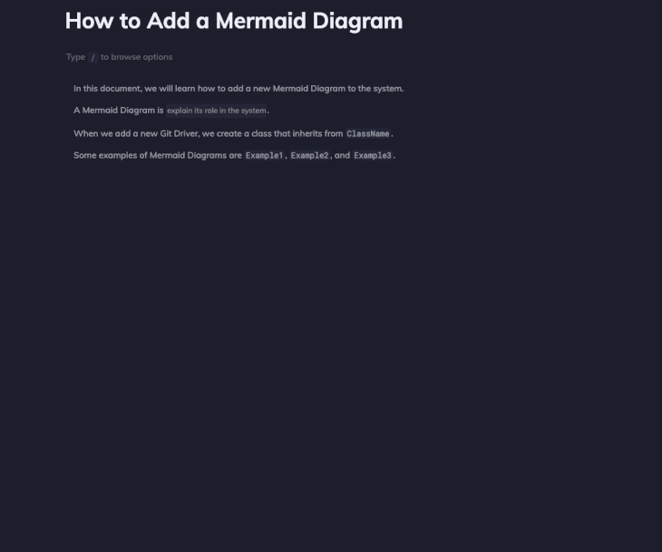

import useBaseUrl from "@docusaurus/useBaseUrl";
import Link from "@docusaurus/Link";

# Diagrams and charts

You can add diagrams and charts to your documentation in Swimm, using Mermaid Syntax in the editor.

To get started, type `/Diagram` to start editing your mermaid diagram.

You can embed Smart Tokens and paths to your diagrams, so they stay up to date as the code evolves 🤯

You can see Mermaid and Swimm in action here:

 

 

Check out the templates from [https://mermaid.live/](https://mermaid.live/) Mermaid Live Editor.

 

This document is automatically kept up-to-date using [Swimm](https://swimm.io).
