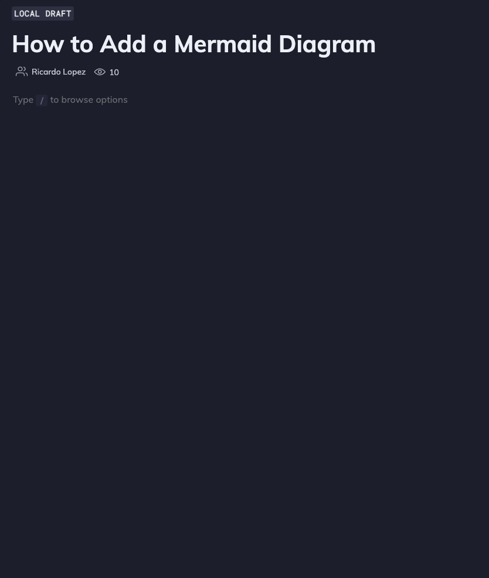

import useBaseUrl from "@docusaurus/useBaseUrl";
import Link from "@docusaurus/Link";

# Diagrams and charts

You can add diagrams and charts to your documentation in Swimm, using [Mermaid](https://mermaid.js.org/) Syntax in the editor.

To get started, type `/Diagram` to start editing your mermaid diagram.

## Mermaid + Swimm = up to date Diagrams 🤯

You can now create and edit Mermaid diagrams straight from Swimm’s editor:

The real value comes when creating diagrams with Swimm’s [Smart Tokens](https://docs.swimm.io/Features/editor-commands#add-smart-tokens). Type a backtick (\`) within your diagram labels to code-couple constants or variables and you won't need to worry about the impact of refactoring on your documentation, as well as renaming those values referenced in your diagram. This means - diagrams that are up to date with your code 🤯

 

---

This document is automatically kept up to date using [Swimm](https://swimm.io).
