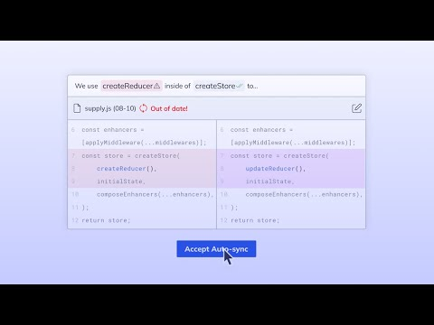

import useBaseUrl from "@docusaurus/useBaseUrl";
import Link from "@docusaurus/Link";
import ReactPlayer from "react-player";

# Keeping docs up to date (Auto-sync)

## Swimm's patented Auto-sync feature

Swimm’s Auto-sync automatically keeps code snippets up to date with routine code changes via GitHub.

Swimm alerts you when code changes affect your documentation and lets you address it quickly & easily. This way, your documentation is always accurate and synced with your code.

### What happens when Auto-sync needs more information?​

If Auto-sync decides that a change is impactful enough that Swimm oversight is needed, the following things happen:

- The Swimm verification check will fail. Depending on your configuration, this means it will block the commit or Pull Request until the issue is fixed, or it will open an issue that needs to be resolved within a certain time frame.
- Any affected documentation will be marked as potentially out of date and you will be updated.

To learn more, watch the video below:

This document is automatically kept up-to-date using [Swimm](https://swimm.io).
