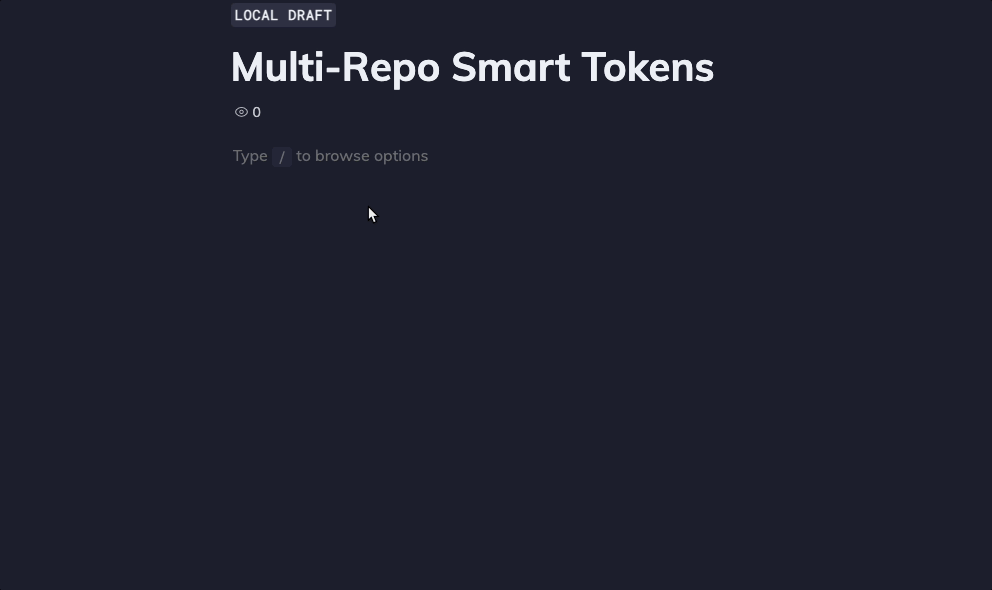
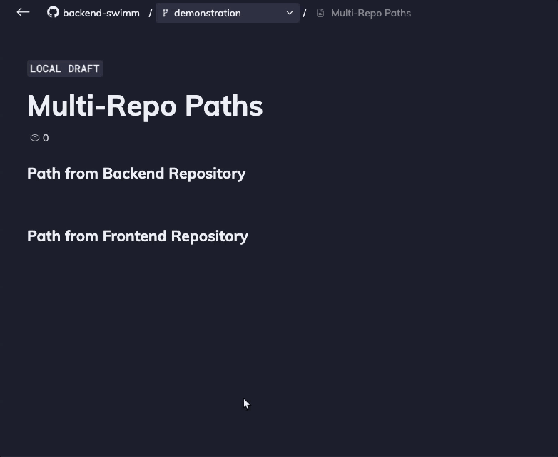

import useBaseUrl from '@docusaurus/useBaseUrl';
import Link from '@docusaurus/Link';

With Swimm, you can describe flows spanning across multiple repositories, by including snippets, tokens and paths from multiple repositories.

## Snippets

To add a snippet from a different repository than the one you are on, simply add a snippet, and then click on `All` `Repos`. You can then select the repo you'd like to take the snippet from.

## Tokens

Type \` (backtick), and then type your token reference (variable, class, etc.). Swimm will suggest content from multiple repositories. Note you can click the repository dropdown and then check/uncheck repositories to include in search results.

## Paths

To add paths from multiple repositories, type `/` (slash command), and select `Path`. Then, select your desired path and confirm.

# How will multi-repo content affect my CI checks?

For example, say you are on a repo called `backend-repo`, and you create a document that has elements from both `backend-repo` and `frontend-repo`. If you install [Swimm's GitHub App](https://docs.swimm.io/continuous-integration/github-app), it will run a check on every Pull Request. If a code reference from `backend-repo` becomes outdated, the CI check will fail, and automatically update or notify you, depending on the specific change and your configuration. On the other hand, in case a code reference on `frontend-repo` becomes outdated, no check will fail - to avoid weird development dependencies where a PR on `backend-repo` is blocked waiting for a change in `frontend-repo` or vice versa.

 

In the above scenario, the `Needs` `Review`page will mark the document as outdated and allow you to update it. In addition, upon reading or editing this document, all outdated references (from either repo) will be presented as outdated and you will be able to edit the document.

---
This document is automatically kept up to date using [Swimm](https://swimm.io).
