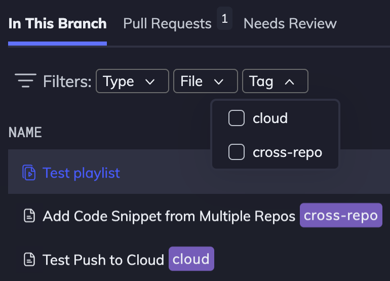
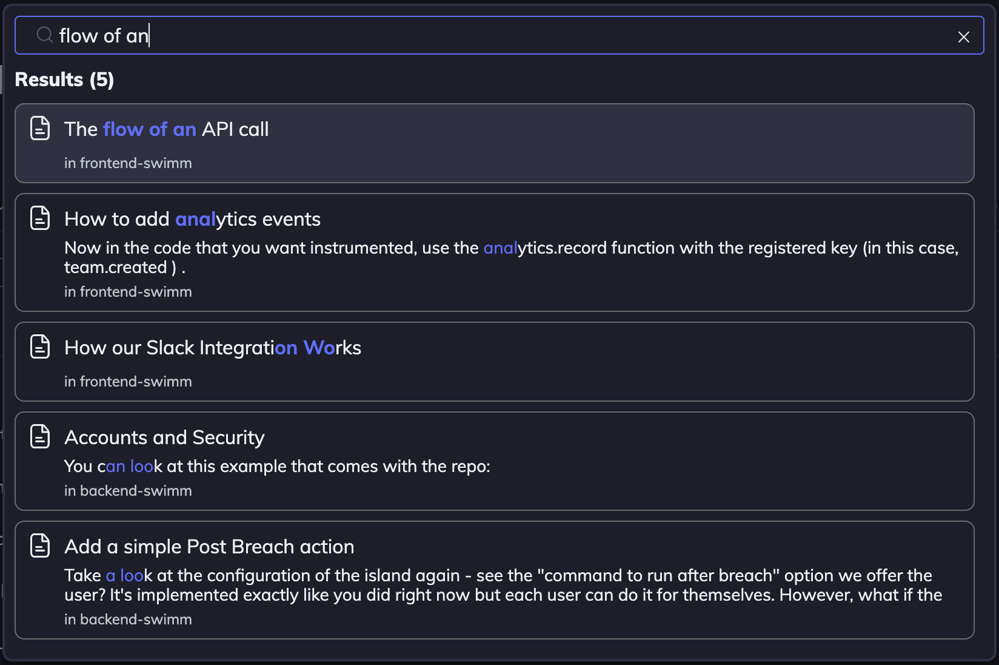

import useBaseUrl from "@docusaurus/useBaseUrl";
import Link from "@docusaurus/Link";

With Swimm, information is easy to find. There are a few useful ways to organize and find your docs:

## Right in your IDE

With [Swimm’s IDE plugins](https://docs.swimm.io/ide-integrations/ide-plugins), developers read documentation inside their IDE and no longer have to switch contexts to an external place to find documentation.

## Playlists

A Swimm Playlist is just what it sounds like: a collection of documents, links, videos, Markdown files, and images stored as a Playlist collection in a particular order.

Learn more about Playlists [here](https://docs.swimm.io/Features/Swimm-Playlists).

## Tags

You can put tags on each doc, and then filter the tags in your repos to quickly find relevant documents.

Tags can be assigned to local drafts, as well as docs that have been committed to the repo.

When a tag is created, it can be used across all of your workspace repositories.

## Global Search

Use Ctrl+K (PC) / ⌘Command+K (Mac) to search across all repositories in your workspace.

---

This document is automatically kept up to date using [Swimm](https://swimm.io).
