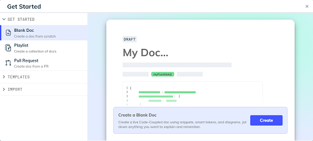

import useBaseUrl from "@docusaurus/useBaseUrl";
import Link from "@docusaurus/Link";

# Creating content in Swimm

Click `Create` on the repo page and see the options to get started writing documentation:

Here are some of the options you’ll see there:

## **Blank Doc**

You can always start creating documentation with a completely blank doc.

 

## **Playlist**

If you want to create a collection of docs for your teammates to go over in a certain order, we suggest that you start with Swimm Playlists. Learn more about <Link href="https://docs.swimm.io/Features/Swimm-Playlists"> Swimm Playlists.</Link>

 

## **Pull Request**

You can start writing a doc from a pull request to document recently added features, refactors etc. You have the option to document either open or merged pull requests.

Note that Swimm will automatically add code snippets with the important parts that were changed or created during this PR. All you need to do is add the description and other relevant information.

## **Templates**

Swimm has a <Link href="https://swimm.io/blog/how-to-use-swimm-templates/"> bank of templates</Link> to help you get started with common topics. No need to invent the wheel, just use our suggestions and just fill in the blanks.

Swimm is always developing new templates. The number of template options will continue to grow so stay tuned for new templates coming up soon.

## **Import**

Another option for creating documentation is to start by importing existing Markdown files (from your local machine, your repo, Notion or Confluence) - to be converted to a Swimm doc.

This document is automatically kept up-to-date using [Swimm](https://swimm.io).
