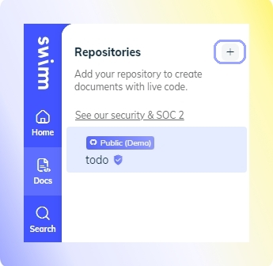
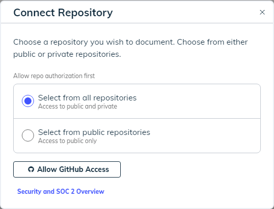
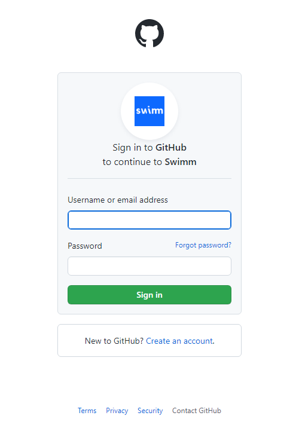

import useBaseUrl from '@docusaurus/useBaseUrl';
import Link from '@docusaurus/Link';
import OrganizationAccess from '../../static/img/organization_access.png';

**Step 1:** When you create a new workspace, it will consist of a single repository - <Link to="/getting-started-guide/demo-repo">Swimm's demo repo</Link>. To add repositories, click on the `Docs` icon on the sidebar, and click on the `+` sign.

**Step 2:** Connect your repository. Select a public or private repo and click on `Allow GitHub Access`.

Notice: we never store your code or your docs on our server. <Link href="/security">Read more about our security and privacy overview.</Link> 

**Step 3:** Sign into GitHub

**Step 4:** Search and then select the repository you plan to document. Once you’ve selected your repo, you can get started creating or reviewing documentation. 

## Troubleshooting
If you don't see the repository you wish to add, Swimm doesn't have the correct <Link href="/security">permissions required</Link> and you’ll need to click the `Manage Scope` button at the bottom of the dialog box.

If you still cannot locate your repo, please reach out to us on our <Link href="https://swimmcommunity.slack.com/ssb/redirect/">Community Slack Channel.</Link>

### Authorizing Swimm's OAuth App
Swimm installs GitHub's OAuth App to read and write documentation on your behalf. To allow access to a repository, an owner of the organization needs to approve the app. You can request organization approval for an App using GitHub, see [GitHub's official document about this](https://docs.github.com/en/account-and-profile/setting-up-and-managing-your-personal-account-on-github/managing-your-membership-in-organizations/requesting-organization-approval-for-oauth-apps).

As an owner of the organization, follow [these instructions to authorize Swimm](https://docs.github.com/en/organizations/managing-oauth-access-to-your-organizations-data/approving-oauth-apps-for-your-organization).

If you wish to know who the owners of your GitHub organization are, you can find out from GitHub - follow the instructions on [GitHub's official document](https://docs.github.com/en/account-and-profile/setting-up-and-managing-your-personal-account-on-github/managing-your-membership-in-organizations/viewing-peoples-roles-in-an-organization).

#### Understanding `Organization access`
When authorizing Swimm's OAuth app, you may see the organizations you are part of, alongside a mark next to each of them:

1. In case the owner of the organization has already authorized Swimm - the organization is marked with a green check sign. For example, `FullstackAcademy` in the image above.
2. In case no one has requested to authorize Swimm and you are not the owner of the organization - you will see a `Request` button next to it. For example, `learn-co-students` in the image above.
3. In case someone has already requested to authorize Swimm, a `request pending` text will appear instead of the `Request` button.
4. In case you are an owner of the organization, you will see a `Grant` button to authorize Swimm.
5. In case an owner of the organization has declined a previous request (by any user) for Swimm, you will see a red `X` next to the organization.

As an owner of the organization, follow [these instructions to authorize Swimm](https://docs.github.com/en/organizations/managing-oauth-access-to-your-organizations-data/approving-oauth-apps-for-your-organization).

## How to change the order of repositories

You can change the order of repositories displayed on the left-side navigation. Hover over any repository and drag the repository using the 6-pin icon. 

Note that changing the order of your repositories only affects your Swimm account and not other members' accounts.