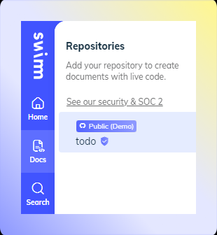
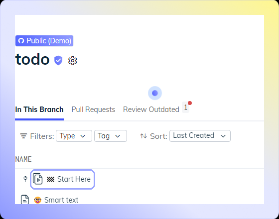

import useBaseUrl from '@docusaurus/useBaseUrl';
import Link from '@docusaurus/Link';

Swimm created a public demo repository to serve as a quick introduction & overview of Swimm’s platform. It also allows you to play with Swimm without the need to add your own repository.

We hope that checking out this demo repo will inspire you to explore Swimm and get started.

## How to get to Swimm’s demo repo

 

When you create a new workspace, this repo will be automatically added to your workspace. Just click on the `Docs` icon on the sidebar, and select the repository.

## How to use Swimm’s demo repo

When you select the demo repository, you will see it already has Swimm documents, and a Playlist called `Start Here`. Click on that playlist and go through it, the demo repo will speak for itself.

This playlist will guide you through creating snippets and tokens, playing around with Swimm's Auto-sync feature, and more.

---
This document is automatically kept up to date using [Swimm](https://swimm.io).
