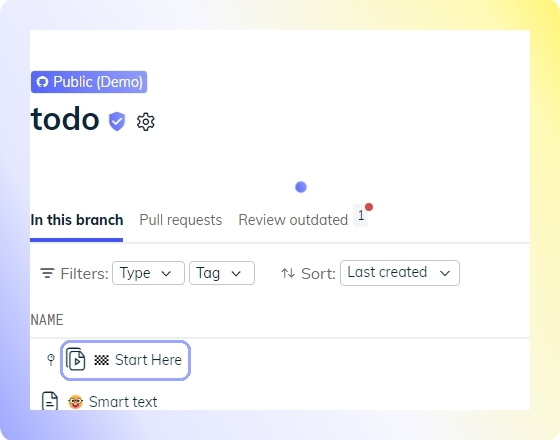

import useBaseUrl from '@docusaurus/useBaseUrl';
import Link from '@docusaurus/Link';

Swimm created a public demo repository to serve as a quick introduction & overview of Swimm’s platform. It also allows you to play with Swimm without the need to add your own repository. You can create a document with snippets and smart tokens, and even play around with our <Link to="/Features/keeping-docs-up-to-date">Auto-sync</Link> feature.

We hope that checking out this demo repo will inspire you to explore Swimm and get started.

Swimm's demo repository is a cloned MIT-licensed [repository](https://github.com/tastejs/todomvc) created by [Addy Osmani](https://github.com/addyosmani) to help developers become familiar with new frontend technologies. Here's how they explain it:

Under the [`examples` folder of this repo](https://github.com/tastejs/todomvc/tree/master/examples), you can find dozens of implementations of the `TODO` app. Each sub-folder is implemented with a different framework.

We chose this repo so you can play around with a framework you feel comfortable with. Just pick the example that matches your stack. If you are not used to any front-end framework, don't worry - just select a generic example to get started.

## How to get to Swimm’s demo repo

 

When you create a new workspace, this repo will be automatically added to your workspace. Just click on the `Docs` icon on the sidebar, and select the repository.

## How to use Swimm’s demo repo

When you select the demo repository, you will see it already has Swimm documents, and a Playlist called `Start Here`. Click on that Playlist and go through it, the demo repo will speak for itself.

This Playlist will guide you through creating snippets and tokens, playing around with Swimm's Auto-sync feature, and more.

# I completed the 'Start Here' Playlist, now what?

* <Link to="/getting-started-guide/connecting-repositories-to-Swimm">Connect your repo</Link>.
* <Link to="/getting-started-guide/creating-a-doc">Create your first doc on your repo</Link>.

---
This document is automatically kept up to date using [Swimm](https://swimm.io).
