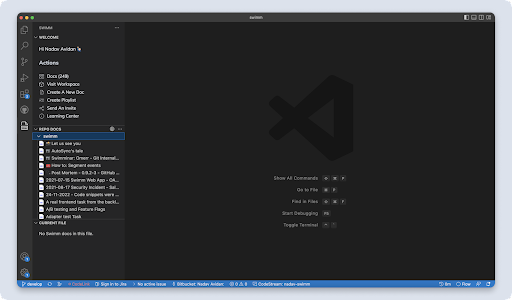

import Link from '@docusaurus/Link';
import useBaseUrl from '@docusaurus/useBaseUrl';

# IDE Plugins - VS Code

Setting (to be nested)

## Step 1: Install
Get your Visual Studio Code extension <Link href="https://marketplace.visualstudio.com/items?itemName=Swimm.swimm">here</Link>.

## Step 2: Log in or register

Once installed, you will see Swimm's icon in your IDE in the “Activity Bar” on the left.

Click it, and **log in** if you already have an account. If not, **register**! It is completely free and takes just a couple of minutes.

## Register
When you Register, you will go through an onboarding wizard that will require you to do two things:

1. Create a workspace
2. Connect a repository

After that, you will need to log in👇

## Login
Clicking the login button will redirect you to a browser. This is a standard login mechanism for IDE extensions.

Getting Started (to be nested)

## The Swimm panel
After logging in, you will see Swimm’s panel:

It contains 3 sections:

1. **WELCOME** - General Swimm actions are here.
2. **REPO DOCS** - All Swimm docs grouped by repository.
3. **CURRENT FILE** - Swimm docs related to an opened file.

**No docs yet?**

If you don’t have any Swimm docs, click “Create A New Doc.” Currently, most actions will navigate you to the Swimm Web Platform.

*(Stay tuned: soon, we will be releasing more actions that you can do directly in VS Code)*

Swimm’s VS Code extension and Web Platform complement one another.

## Create docs with Swimm’s code-coupled editor
At the moment, creating and editing docs content is done via the webapp. To do so, login into your Swimm account and add a repo to your workspace. 

That’s all! You’re ready to create your own code-coupled documentation.

Learn more about <Link to="https://docs.swimm.io/docs/getting-started/creating-a-doc/">how to get started with your first doc.</Link>

## Committing your first doc
To see docs in the IDE, documentation needs to be committed to a repository. You will likely want to commit your documentation to a new branch. 

Once that branch is merged to your main branch, it will become part of your main documentation.

## Finding & reading docs in VS Code

:::note
Docs are part of the repositories. Same as with code, you are responsible for pulling the latest version of your repository. Make sure you are locally on the same branch as your documents. To verify, you can open the local `.swm` folder and find your documents there (if not, you should probably switch to the right branch and/or pull the latest changes).
:::

We have designed finding docs in your IDE to be streamlined so that you can toggle between your docs and the code seamlessly.

There are several ways to access docs in your IDE.

### 1. Browse and read any doc by clicking docs from the “Repo Docs” panel

:::caution
Make sure you pull the latest version of the branch you are on.
:::

Clicking on any doc from the list will open it in the IDE.

### 2. Read existing docs in your codebase

Just above the code, you’ll see a comment with a brief description of a code snippet that is in the document.

To open and review the document, click on either the comment or the wave icon.

### 3. Jump to code
Inside docs, for any snippet, you can click on the snippet path.
That will open the file in your IDE and show the highlighted section in the code.

Troubleshootig (to be nested)

## Q&A
**Why do I need to register to Swimm?**
In order to start using Swimm, you will need a Swimm account with at least one workspace. Your repositories need to be associated with a workspace. It is required for Swimm to be able to store some minimal metadata about your repositories. 

## Troubleshooting and Error messages:
**Error: “Swimm repository not detected”**
The repository doesn’t have any Swimm docs and has never been connected to your Swimm workspace.

**Error: “Cannot retrieve the workspace or repo information”**
**Or “You are not a member of a workspace where [repo name] is connected to.”**
The repository is not connected to a Swimm workspace or you are not a member of a workspace where this repository is connected to.

**In case of all the errors listed above, make sure that:**
1. **Your organization is registered and has a Swimm workspace.**

    If not, create one - it’s free.
2. **You are a member of that workspace.**

    If not, request from your administrator, to join the workspace.
3. **The repository you are working on has been added to the workspace.**

    If not, login to the workspace and “add a repo” to your workspace.
4. **You have editing GitHub permissions to that repository.**

    If not, request your administrator to provide you with such.
5. **You are logged in to Swimm in the IDE.**

## Supported Scenarios
**Single repo**

- Opening a single repo from VS Code is the most straightforward way.

**Sibling Multi-Repo**

- Opening a folder with multiple same-level repositories. This is also supported by Swimm. Swimm’s welcome panel will detect the active repo and all the information will be relative to it.

**Nested Repositories**

- Nested repositories (such as SubModules) are not a supported pattern. 

