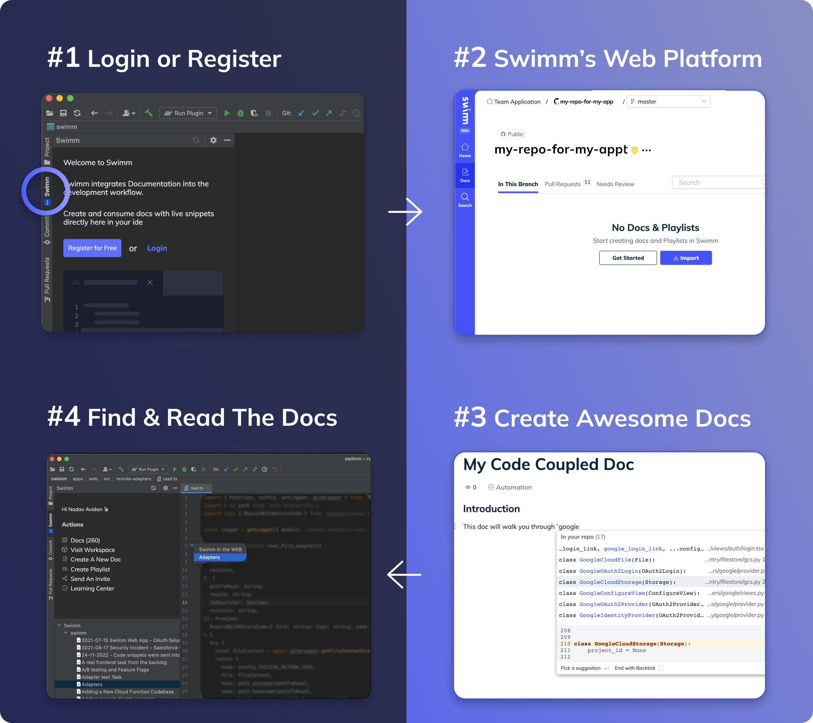

import useBaseUrl from "@docusaurus/useBaseUrl";
import Link from "@docusaurus/Link";

# Swimm's IDE plugins

<Link href="https://swimm.io/blog/ide-integrated-documentation-using-swimm/">
  {" "}
  IDE Integrated documentation
</Link> is the most convenient method for finding and reading documentation. With
Swimm’s IDE plugins, developers read documentation inside their IDE and no longer
have to switch contexts to an external place to find documentation.

**Swimm supports integrations with VS Code and IntelliJ IDEs.**

## Why use Swimm's IDE plugins?

With Swimm's IDE plugins, you can read your documentation in the "ideal place."

- Read all available docs right in your IDE.
- Switch back and forth from code to your docs seamlessly.
- Discover existing documentation in your codebase.
- Review annotations easily when reviewing or writing new code.
- Eliminate context switching and the alt + tab nightmare.

<Link href="https://plugins.jetbrains.com/plugin/20716-swimm">
  Get Swimm’s JetBrains plugin here.
</Link>
 
<Link href="https://marketplace.visualstudio.com/items?itemName=Swimm.swimm">
  Get Swimm’s VS Code plugin here.
</Link>

 

 

---

This document is automatically kept up to date using [Swimm](htt
ps://swimm.io).
