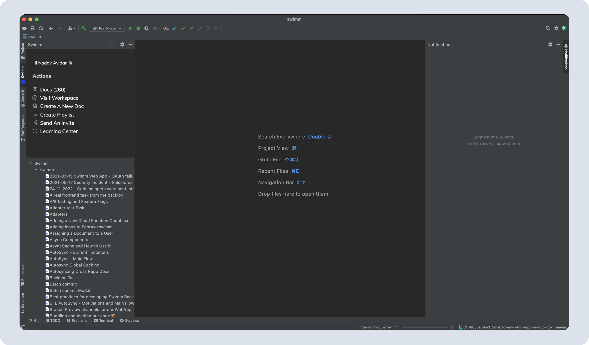
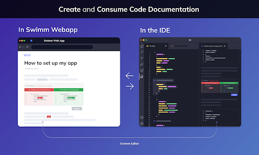
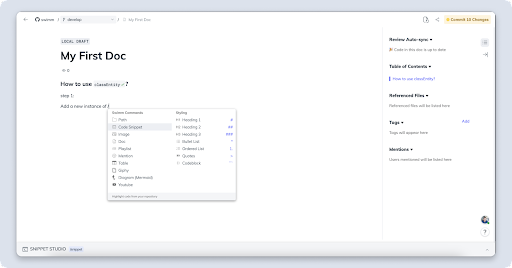
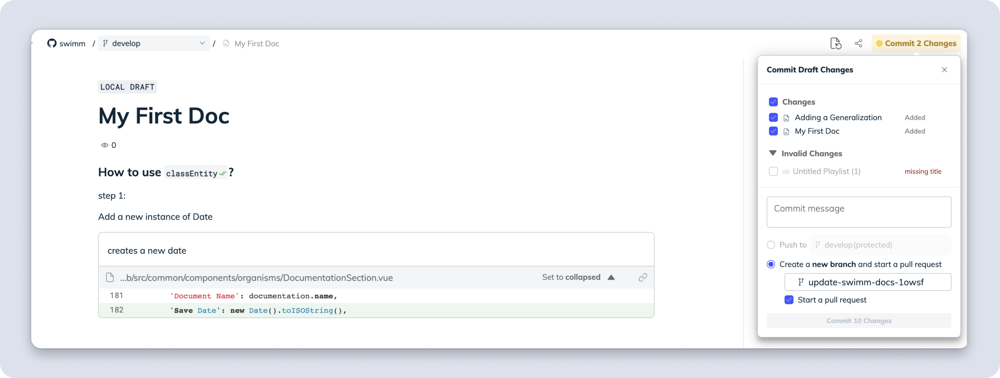
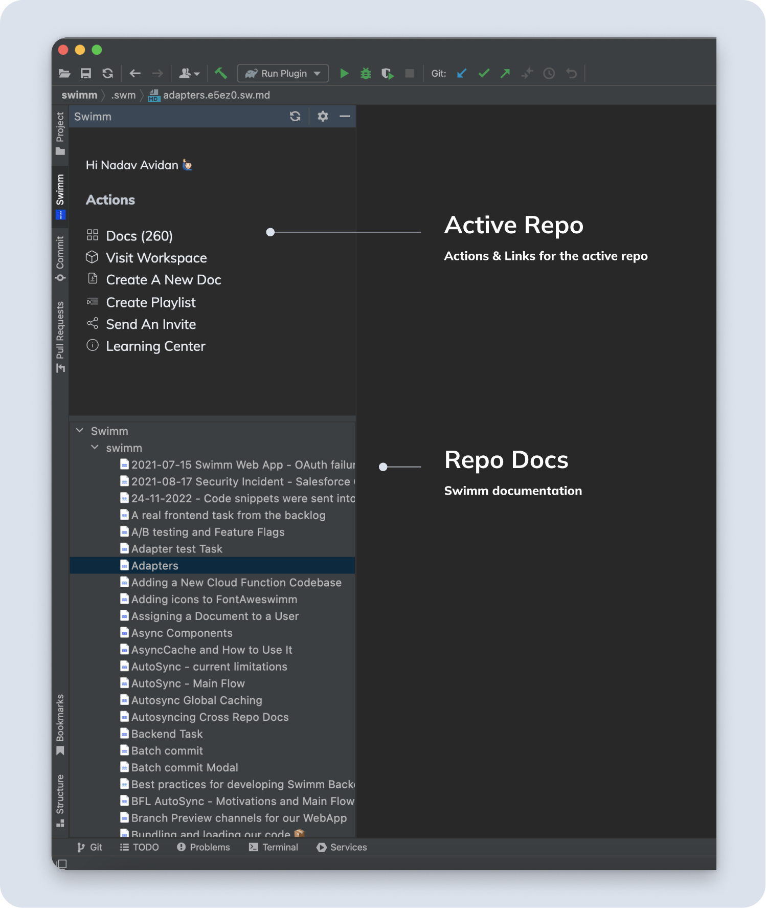
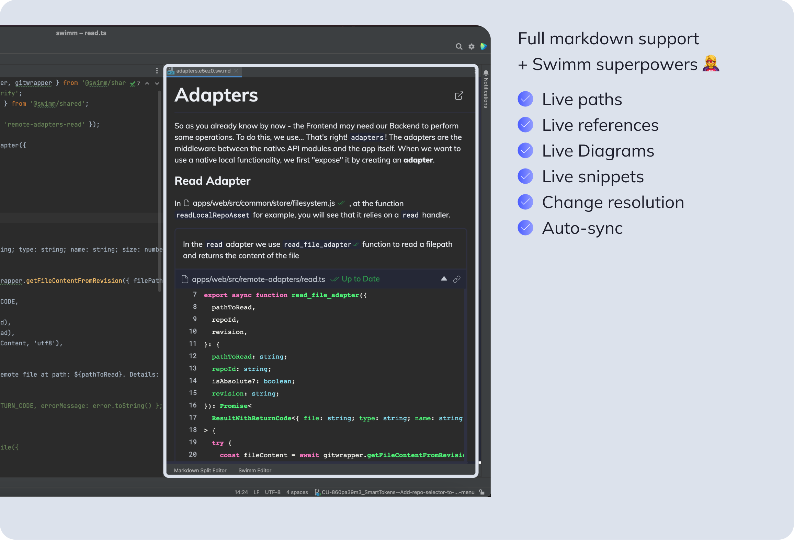
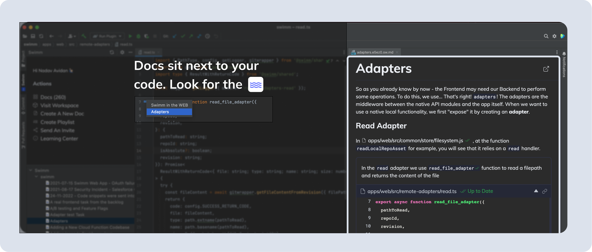
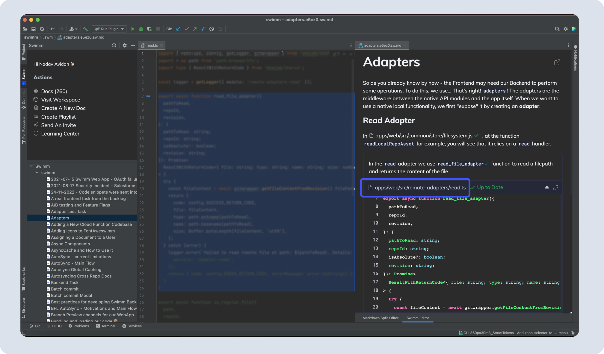

import Link from '@docusaurus/Link';
import useBaseUrl from '@docusaurus/useBaseUrl';

# Getting Started

### The Swimm panel
After logging in, you will see Swimm’s panel:

It contains 2 sections:

1. **WELCOME** - General Swimm actions are here.
2. **REPO DOCS** - All Swimm docs grouped by repository.

### No docs yet?

If you don’t have any Swimm docs, click “Create A New Doc.”  
Currently, most actions will navigate you to the Swimm Web Platform. 
*(Stay tuned: soon, we will be releasing more actions that you can do directly in your JetBrains IDE)* 
Swimm’s JetBrains plugin and Web Platform complement one another.

### Create docs with Swimm’s code-coupled editor
At the moment, creating and editing docs content is done via the webapp. 
To do so, login into your Swimm account and add a repo to your workspace.  
That’s all! You’re ready to create your own code-coupled documentation.

Learn more about <Link to="https://docs.swimm.io/docs/getting-started/creating-a-doc/">how to get started with your first doc.</Link>

### Committing your first doc
To see docs in the IDE, documentation needs to be committed to a repository. You will likely want to commit your documentation to a new branch. 

Once that branch is merged to your main branch, it will become part of your main documentation.

### Finding & reading docs in JetBrains IDE

:::note
Docs are part of the repositories. Same as with code, you are responsible for pulling the latest version of your repository. Make sure you are locally on the same branch as your documents. To verify, you can open the local `.swm` folder and find your documents there (if not, you should probably switch to the right branch and/or pull the latest changes).
:::

We have designed finding docs in your IDE to be streamlined so that you can toggle between your docs and the code seamlessly.

There are several ways to access docs in your IDE.

### 1. Browse and read any doc by clicking docs from the “Repo Docs” panel

:::caution
Make sure you pull the latest version of the branch you are on.
:::

Clicking on any doc from the list will open it in the IDE.

### 2. Read existing docs in your codebase

Just right next to the code, you’ll see the Swimm wave icon on the left gutter.

To open and review the document, click on the wave icon.

### 3. Jump to code
Inside docs, for any snippet, you can click on the snippet path.
That will open the file in your IDE and show the highlighted section in the code.

