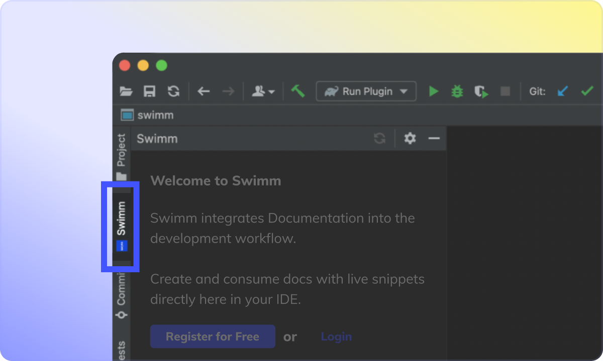

import useBaseUrl from "@docusaurus/useBaseUrl";
import Link from "@docusaurus/Link";

# Setting up

## Step 1: Install

Get your JetBrains plugin <Link href="https://plugins.jetbrains.com/plugin/20716-swimm">here</Link>. 

Once installed, you will see Swimm's panel in your IDE. 

**Log in** if you already have an account. If not, **register** - it's completely free and takes just a couple of minutes.

## Register

When you register, you will go through an onboarding wizard that will require you to do two things:

1.  Create a workspace
2.  Connect a repository

After that, you will need to log in👇

## Login

Clicking the login button will redirect you to a browser. This is a standard login mechanism for IDE plugins.

---

This document is automatically kept up to date using [Swimm](https://swimm.io).
