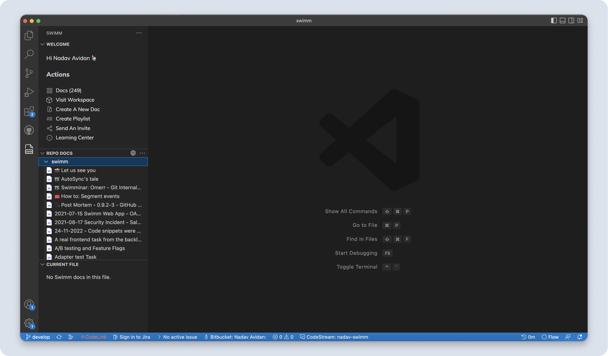
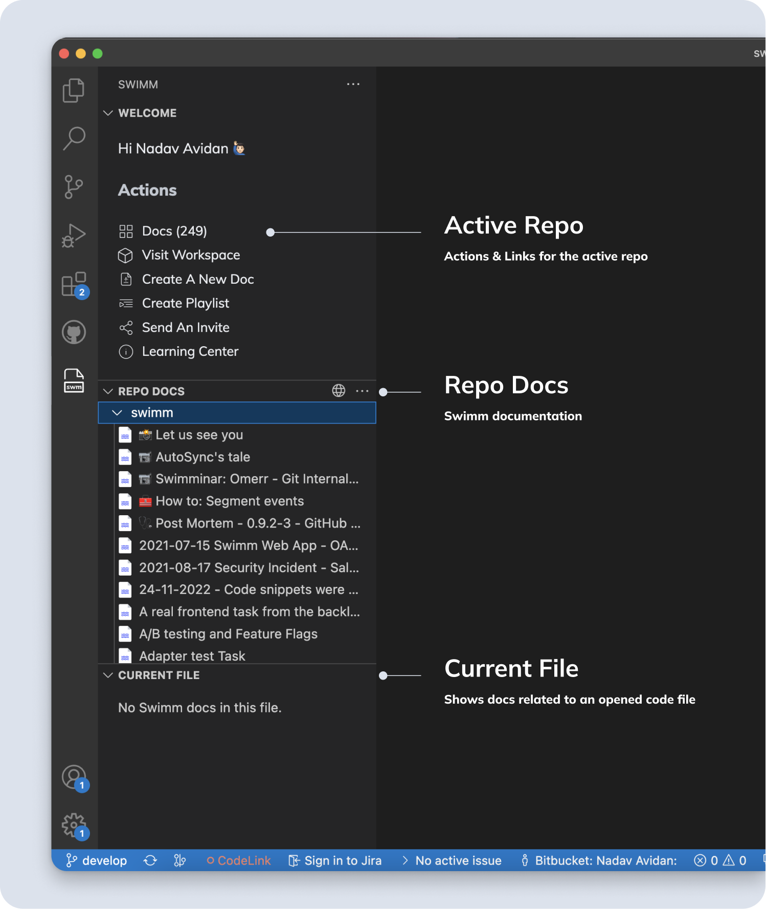
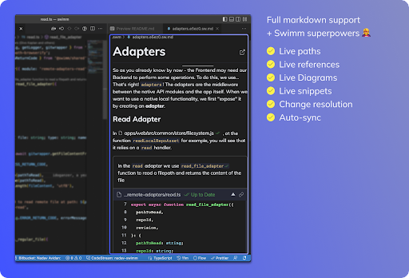
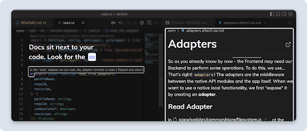
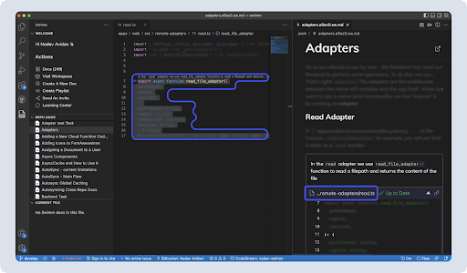

import useBaseUrl from '@docusaurus/useBaseUrl';
import Link from '@docusaurus/Link';

# Getting started

### The Swimm panel

After logging in, you will see Swimm’s panel:

<br/>

<div align="center"></div>

<br/>

It contains 3 sections:

1.  **WELCOME** - General Swimm actions are here.
    
2.  **REPO DOCS** - All Swimm docs grouped by repository.
    
3.  **CURRENT FILE** - Swimm docs related to an opened file.


### No docs yet?

If you don’t have any Swimm docs, click “Create A New Doc.”
### 📄 ide/webviews/src/components/LoggedInPanel.vue
```vue
     {
       text: 'Create A New Doc',
       href: newDocRoute.value,
       iconName: 'doc-file-change',
       shouldDisable: isMultiRepoEmptyState.value || isNoWorkspaceState.value,
     },
```

Note that currently, most actions will navigate you to the Swimm Web Platform.<br/>
_Stay tuned: soon, we will be releasing more actions that you can do directly in VS Code._<br/>

As you can see below, Swimm’s VS Code extension and Web Platform complement one another.

<br/>

<div align="center"></div>

<br/>

### Create docs with Swimm’s code-coupled editor

At the moment, creating and editing docs content is done via the webapp.<br/>
To get started writing docs, login into your Swimm account and add a repo to your workspace.<br/>

That’s all! You’re now ready to create your own code-coupled documentation.

Learn more about <Link to="https://docs.swimm.io/getting-started-guide/creating-a-doc/">how to get started creating your first doc.</Link>

<br/>

<div align="center"></div>

<br/>

### Committing your first doc

To see docs in the IDE, documentation needs to be committed to a repository. You will likely want to commit your documentation to a new branch.

Once that branch is merged to your main branch, it will become part of your main documentation.

<br/>

<div align="center"></div>

<br/>

### Finding & reading docs in VS Code

:::note Docs are part of the repositories. Same as with code, you are responsible for pulling the latest version of your repository. Make sure you are locally on the same branch as your documents. To verify, you can open the local `.swm` folder and find your documents there. If not, you should probably switch to the right branch and/or pull the latest changes. :::

We have designed finding docs in your IDE to be streamlined so that you can toggle between your docs and the code seamlessly.

There are several ways to access docs in your IDE.

### 1\. Browse and read any doc by clicking docs from the “Repo Docs” panel
### 📄 ide/extensions/vscode/package.json
```json
           "name": "Repo Docs",
```

:::caution<br/>
Make sure you pull the latest version of the branch you are on.<br/>
:::

<br/>

<div align="center"></div>

<br/>

Clicking on any doc from the list will open it in the IDE.

<br/>

<div align="center"></div>

<br/>

### 2\. Read existing docs in your codebase

<br/>

<div align="center"></div>

<br/>

Just above the code, you’ll see a comment with a brief description of a code snippet that is in the document.

To open and review the document, click on either the comment or the wave icon.

### 3\. Jump to code

Inside docs, for any snippet, you can click on the snippet path. That will open the file in your IDE and show the highlighted section in the code.

<br/>

<div align="center"></div>

<br/>

This document is automatically kept up-to-date using [Swimm](https://swimm.io).
