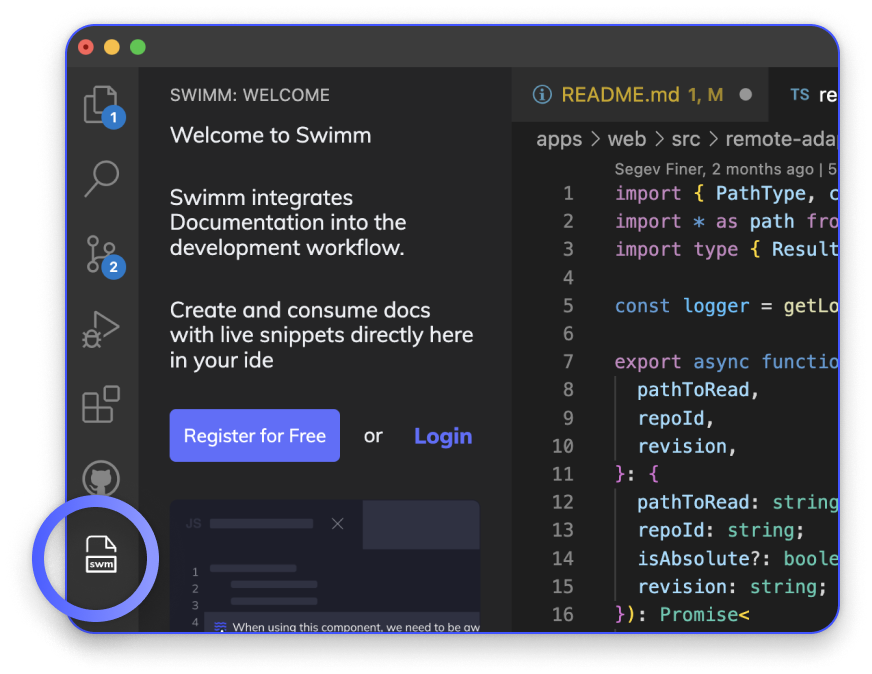

import Link from '@docusaurus/Link';
import useBaseUrl from '@docusaurus/useBaseUrl';

# Setting up

## Step 1: Install
Get your Visual Studio Code extension <Link href="https://marketplace.visualstudio.com/items?itemName=Swimm.swimm">here</Link>. 
Once installed, you will see Swimm's icon in your IDE in the “Activity Bar” on the left. 
Click it, and **log in** if you already have an account. If not, **register**!  
It is completely free and takes just a couple of minutes.

## Register
When you Register, you will go through an onboarding wizard that will require you to do two things:

1. Create a workspace
2. Connect a repository

After that, you will need to log in👇

## Login
Clicking the login button will redirect you to a browser. This is a standard login mechanism for IDE extensions.

