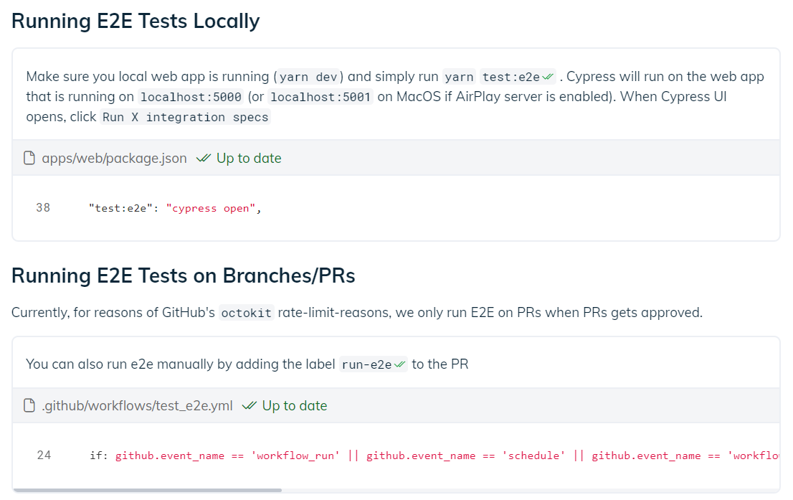
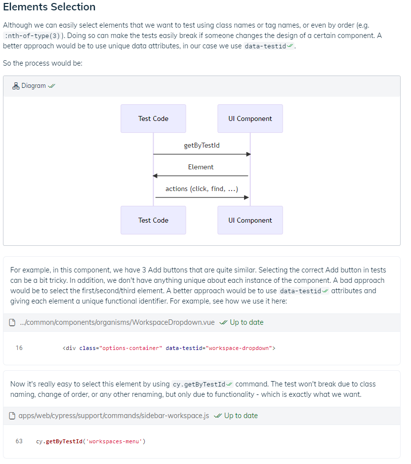

import WhyARealExample from "../../snippets/why-a-real-example.mdx"
import NewToolsConsiderations from "../../snippets/new-tool-considerations.mdx"
import useBaseUrl from '@docusaurus/useBaseUrl';
import Link from '@docusaurus/Link';

# Promoting testing best practices

This is a part of our use case guide series, exploring how code-coupled documents can help engineering teams thrive.

Best practices stem from experience, understanding what works well and what doesn’t. Adhering to best practices can help avoid mistakes, Yet, promoting best practices across the organization can be challenging, especially over time. Using code-coupled documents can greatly assist, and in this post we will show you how.

## General considerations when promoting a new testing tool

In case you are promoting a new testing *tool*, there are a few things to consider. 

<NewToolsConsiderations />

## Explain the different test types

Different engineering organizations rely on different tests for different cases. Some depend only on <Link to="https://swimm.io/blog/end-to-end-testing-challenges-and-lessons-learned/">E2E tests</Link>, while others may rely heavily on component and unit tests including some specific tests for a specific important component.

Be sure to have a clear resource explaining which tests should be written for each case. This will help engineers know when they are expected to create each type of test.

**Each test type and tool may require its own section or document**. In many cases, each test type has its own specific best practices and may use a designated set of tools. For example, E2E tests like Cypress may rely on a library while AB tests like LaunchDarkly have their own tool. Thus, each test type may require a separate resource document.

## Create a testing Playlist

We recommend <Link to="/Features/Swimm-Playlists">Swimm Playlists</Link> be part of your end goal for explaining tests in your organization. This Playlist should include:

* **An overview doc**. This document should explain the different test types and when to use each one.
* **Relevant tools needed**. Explain the relevant tools used and the specific best practices for each test type.

## Explain how to run the tests, not just how to write them

When explaining a specific test type, it’s crucial to also explain how to run the tests. While it may seem straightforward to someone who has been using the codebase for a while, remember that whenever someone new joins the codebase, running the tests is one of the first things they need to know., And it is not always trivial as it may include a few tests.

Also, running tests may be done differently for different environments. For example,running them locally requires different steps than running them on every PR or for a nightly build. Be sure to explain the different scenarios.

### Pro tip:  use snippets and tokens to show how you run your tests

When showing how to run tests, you usually use a command like use `yarn test:e2e`.

Instead of just writing the command, we recommend showing the snippet where this command is taken from. Take a look at this example below:

Coupling with the code has three major advantages:

1. **It makes it clear to the reader what is happening under the hood**. As opposed to just running `yarn test:e2e`, the fact that the snippet is included shows the reader what command is executed (in the example above, `cypress open`) and where it is defined (`apps/web/package.json`).
2. **Documentation is kept up to date**. Thanks to <Link to="/Features/keeping-docs-up-to-date">Swimm’s Auto-sync algorithm</Link> and <Link to="/continuous-integration/github-app">GitHub App</Link>, if the command ever changes (e.g., `test:e2e` changes to `test:full`), or the underlying command changes (for example - we move from using `cypress` to using another tool) - the docs automatically stay up to date.
3. **The document will be found when needed**. When developers need to write tests for the repo, they inevitably stumble upon the command that executes these tests. By using Swimm’s IDE plugin, the developers will see if there is a relevant document next to the line of running the tests.

## Use real examples

The best way to explain how to write tests illustrating your best practices is to give an example. 

Perhaps the most important part is to find a good example using the tool. Note it should be a real example from your codebase rather than a made-up example with pseudo-code. You may need to write such an example if it doesn’t exist already.

<WhyARealExample />

Take a close look at this example below:

Notice that it includes three important parts:

1. **Motivation**.  Why we use this best practice.
1. **The element being tested**. In this case, it’s the `workspaces-menu`.
1. **The test code**. Using a document, we can show the test’s code alongside the element being tested, even though they reside in different parts of the codebase.

## What a document for a specific test type should include

* **Motivation for this type of tests**. For example, if this doc describes component tests, then when we would want to write component tests.
* **Mention the main tools being used**. For example, Cypress for E2E testing.
* **Provide a concrete usage example from the codebase**. Mention the important functions that are used.
* **Describe the best practices**. Dos and dont’s regarding the usage of this library in your codebase.
* **Assumptions**. When there are specific assumptions or tweaks for the use case of this specific codebase, mention them. For example:
  * A workaround to make something work differently than intended.
  * Specific configuration details or parameters we pass to the library’s API for some reason.

### How to debug tests

Sometimes there are special ways and tips to debug tests of a specific kind. These may include a VS Code extension for debugging tests of a specific library, or a `debug` function.

## Additional reading

Our <Link to="/use-case-guides/promoting-new-tools">use case guide for promoting new tools</Link>.
